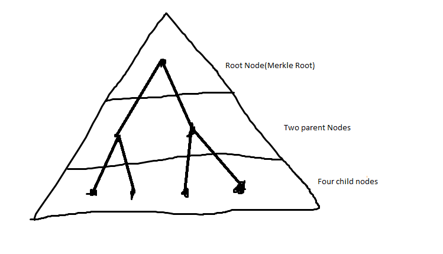

#### What is a Merkle Tree?

A Merkle Tree is a mathematical Data Structure composed of hashes of different blocks of data, which serves as a summary of all transactions in a block. It allows for secure and efficient verification of content in a large body of data.

In dead simple terms,

To Undestand the connection Logic, Imagine a three-layer pyramid.
Now, Consider a 4-transaction block, Let's refer to these transactions as "leaves". Picture these four transactions(or leaves) at the base of the pyramid. Lets add "branches" to these leaves, we draw two lines(or branches) at the second layer of the pyramid such that each "branch" is connected exclusively to two of the "leaves" at the base of the pyramid, now we join these "branches" to a single branch at the top layer of the pyramid(mostly referred to as the Merkle Root, this should look like an upside down tree.) 

Now to simplify the hashing process, Hash the hashes of the leaves(transactions) at the base of the pyramid and include this hash as a part of the two branches at the second level of the pyramid, each then containing the hashes of the two leaves attached exclusively to them, the leaves being the child nodes of the parent nodes(branches). Now hash the hashes of these parent nodes and include them as part of the single branch at the top layer of the pyramid such that the hash of the single branch at the top of the pyramid becomes the parent node of the two branches, which are now child nodes to the top-most pyramid layer(the merkle root).

Now, we have a root node(Merkle Root) that provides a means to query the intergrity of the data of all the transactions. 
If a transaction is added, removed or changed, it changes the hash of the parent node which in turn changes the hash of it's own parent node and eventually changes the hash of the root node. 

This potentially helps us to not have to possess the entire blockchain because we could verify transactions as needed with as little as the transactions derived from a single block by validating the mekle tree and knowing that the transaction is valid.  

As compared to the Single Hash Implementation, proving that a transaction exists in a block requires access to all transaction hashes which would require a lot of storage space. 

Another advantage of Merkle Trees over a single hash is that the proofs and management require tiny amounts of information to be transmitted across networks.