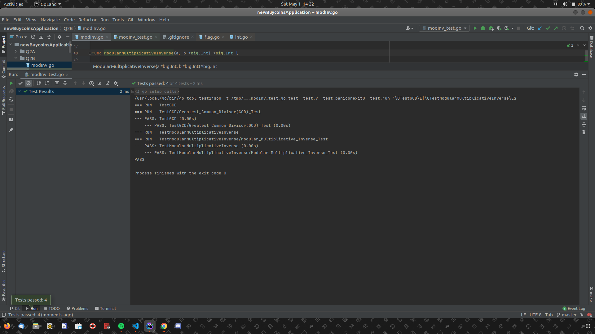

### Modular Multiplicative Inverse
- [Here](https://github.com/youthtrouble/animated-octo-train/blob/master/Q2B/modInv.go), is a program to determine The Modular Multiplicative Inverse of two Integers;

#### Steps to test, for e.g two Integers 42 and 2017 (you need to have go installed on your machine).
- `git clone https://github.com/youthtrouble/animated-octo-train`
- `go run Q2B/modInv.go 42 2017`

